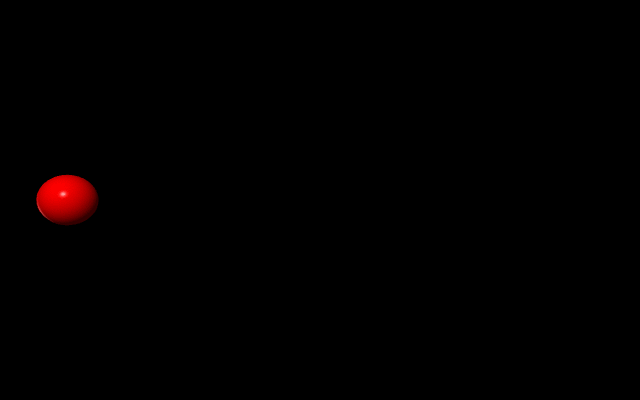

# 可視化について

## EasyVisual.py
vpythonのverが6から7に変わると色々と互換性がなくなってる。
| visual.graph | vpython |
| --- | --- |
| gdisplay | graph   |

```python
python EasyVisual.py
```
をすると、localhostでグラフを表示。


一枚目の画像は背景が教科書通りに行かない。本来はcolor.whiteにすれば自動で背景が黒くなるみたい？

## 3GraphVisual.py

背景黒塗りがbackgroundのcolorを指定しても上手くいかない。また、gdotsなどのdeltaが指定できない。公式サイトを見てもなんという引数を与えればいいのかわからない。とりあえず全部無視して表示した。->radiusとかsizeで変えられる。


## 3Dshapes.py

ベクトル系はすべてvpythonのvectorクラスで設定するみたい。(i,j,k)->vector(i,j,k)。運動させる際は、物体のposを運動方程式の解に基づいて時間変化させることが必要。


## motion_of_balls.py

動画の描画でHarmonic Oscillatorの例を実行しようとしたが上手く動かなかったので簡単な一次元的なボールの運動を描画。
canvasオブジェクトを使えば保存ができるが、gifの保存はできないので1frameずつ保存してconvertで結合してる。
```bash
convert -delay 01 -loop 0 ./motion_dir/motion_of_ball*.png animation_mob.gif
```

